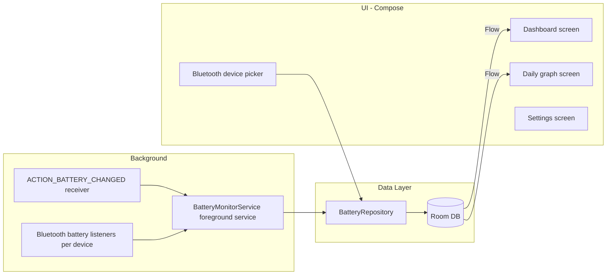

# BatteryMax App Plan

Build BatteryMax: a Compose app that monitors phone battery in the background via a foreground service, stores samples in Room, renders a daily battery graph, and tracks battery levels for **one or more** user-selected Bluetooth devices.

## Architecture

MVVM with a repository layer. Manual DI via the `Application` class (`BatteryMaxApp`).

## Data Layer (Room)

- `BatterySampleEntity`: id, timestamp, levelPercent, isCharging, temperature, voltage, `source` (PHONE or BT device MAC address). One table for phone and all Bluetooth samples.
- `TrackedDeviceEntity`: Bluetooth MAC address (primary key), display name, enabled flag. **Multiple rows** — one per tracked device.
- DAOs with `Flow` queries: all tracked devices, latest sample per source, samples for a day range.
- Sampling policy: insert on battery level change or every 5 minutes; prune data older than ~30 days.

## Background Monitoring

### What runs in the background

When **Background monitoring** is on, `BatteryMonitorService` runs as a **foreground service** (persistent notification). That keeps the process alive so battery updates can be recorded even when the app UI is closed.

- Foreground service type: `connectedDevice` when Bluetooth is granted, otherwise `specialUse`.
- Notification lists phone and each tracked Bluetooth device (one line per device when expanded).
- Watches **every** tracked Bluetooth address (merged flows); connection state is published per address (`BatteryMonitorService.connectionStates`).
- `BootReceiver` listens for `BOOT_COMPLETED` and restarts the service if monitoring was left enabled.
- Dashboard start/stop toggle controls the service.
- Manifest: `FOREGROUND_SERVICE`, `FOREGROUND_SERVICE_CONNECTED_DEVICE`, `FOREGROUND_SERVICE_SPECIAL_USE`, `POST_NOTIFICATIONS`, `RECEIVE_BOOT_COMPLETED`, `REQUEST_IGNORE_BATTERY_OPTIMIZATIONS`, `BLUETOOTH_CONNECT`.

Samples are stored in Room as `BatterySampleEntity` rows. The phone uses `source = "phone"`; each Bluetooth device uses `source = <MAC address>`.

### Phone battery — event and storage

**Event:** the system sticky broadcast `Intent.ACTION_BATTERY_CHANGED`.

The service registers a receiver for that intent. Android delivers it:

- immediately when the receiver is registered (current level), and
- again whenever phone battery state changes (level, charging, temperature, voltage, and so on).

**What is stored:** level percent, charging flag, temperature, voltage, and timestamp (`source = "phone"`).

### Bluetooth battery — events and storage

Android has no public API for Classic Bluetooth battery. For each **tracked** device, `BtBatteryReader.watch(address)` uses:

1. **`android.bluetooth.device.action.BATTERY_LEVEL_CHANGED`** (hidden system broadcast) — main source of level updates for many headsets and watches.
2. **`ACTION_ACL_CONNECTED` / `ACTION_ACL_DISCONNECTED`** — connection state (Dashboard connected vs disconnected UI). On connect, an immediate level read is attempted.
3. **Reflection** `BluetoothDevice.getBatteryLevel()` — initial / on-connect reading.
4. **BLE GATT** Battery Service (`0x180F` / `0x2A19`) — fallback poll about every 5 minutes while connected.

**What is stored:** level percent and timestamp (`source = <MAC address>`; no temperature or voltage for Bluetooth).

Devices screen lists bonded devices; **Track** adds a device (does not remove others); **Stop** removes only that device. Permissions: `BLUETOOTH_CONNECT` (runtime, API 31+), legacy `BLUETOOTH` for API <= 30.

### When a record is written (sampling policy)

Not every event is written to the database. `BatteryRepository.recordSample` only inserts if:

- the **level percent changed**, or
- at least **5 minutes** (`MIN_SAMPLE_INTERVAL_MS`) passed since the last stored sample for that source.

A **5-minute timer** in the service also re-records the last known level for the phone and each tracked Bluetooth device (still subject to the same rules), so the graph keeps points even when the level sits still. Data older than ~30 days is pruned periodically.

| Source | Trigger events | Stored when |
| --- | --- | --- |
| Phone | `ACTION_BATTERY_CHANGED` (+ 5-minute tick) | Level changed or ≥5 minutes since last sample |
| Bluetooth | `BATTERY_LEVEL_CHANGED`, connect + reflection/GATT, 5-minute tick | Same sampling policy |

In short: the app **reacts to system (and Bluetooth) battery events**, then **filters** writes so the database does not fill with identical levels every few seconds.

## UI (Compose, Material 3)

Four destinations with Navigation Compose:

- **Dashboard**: phone battery card; one Bluetooth card per tracked device (large % when connected, smaller % + Disconnected chip when not); monitoring toggle.
- **Graph**: device chips for Phone and all tracked devices; day navigation; zoom presets (1h, 3h, 100%, fit-to-data); Now button scrolls to current time.
- **Devices**: pull-to-refresh bonded list, connected devices first; track/stop multiple devices.
- **Settings**: version (`Version 1 (yyyy.MMddHH)`), permission status, battery-optimization opt-out.

## Versioning

- `versionName` = `"1"`
- `versionCode` = `yyyyMMddHH` at build time (local clock)
- Settings formats the code as `yyyy.MMddHH` for display

## Dependencies

- Room (runtime, ktx, compiler via KSP) + KSP plugin
- Navigation Compose, Lifecycle ViewModel Compose
- Vico (`compose-m3`) for charts

## Task Checklist

- [x] Add Room/KSP, Navigation Compose, ViewModel, and Vico dependencies
- [x] Create Room entities, DAOs, database, and BatteryRepository
- [x] Implement BatteryMonitorService and boot receiver
- [x] Implement Bluetooth battery reading and connection state tracking
- [x] Build Dashboard, Graph, Devices, and Settings screens
- [x] Wire navigation, manifest permissions, and verify build
- [x] Support multiple tracked Bluetooth devices (list in DB, service, Dashboard, Graph, Devices)
- [x] Date/hour-based versionCode with fixed versionName `1`

## Verification

Build with Gradle, then test on a device: enable monitoring, track two or more paired devices, confirm Dashboard cards and notification update per device, and Graph chips list each tracked device.
