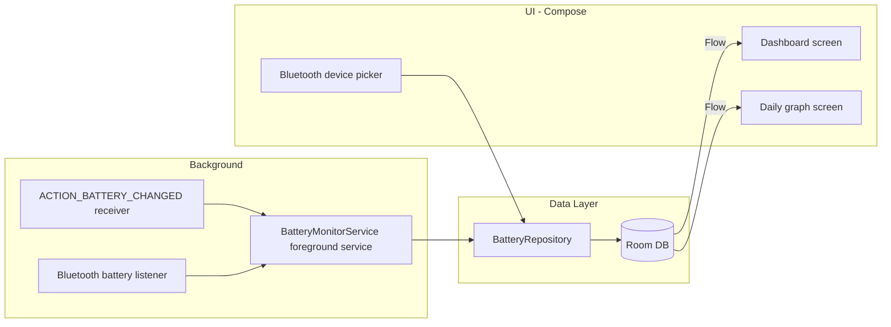

# BatteryMax App Plan

Build BatteryMax: a Compose app that monitors phone battery in the background via a foreground service, stores samples in Room, renders a daily battery graph, and additionally tracks the battery level of a user-selected Bluetooth device.

## Current State

Fresh Compose template ([app/build.gradle.kts](../app/build.gradle.kts)): Kotlin, Material 3, minSdk 24, targetSdk 36, single `MainActivity`. No Room, no DI, no navigation yet.

## Architecture

MVVM with a repository layer. Manual DI via a simple `AppContainer` in the `Application` class (keeps the build light; Room already needs KSP, no need for Hilt).

## Data Layer (Room)

- `BatterySampleEntity`: id, timestamp, levelPercent, isCharging, temperature, voltage, `source` (PHONE or BT device address). One table for both phone and Bluetooth samples keeps the daily-graph query uniform.
- `TrackedDeviceEntity`: Bluetooth MAC address, display name, enabled flag.
- DAOs with `Flow` queries: latest sample per source, samples for a given day range.
- Sampling policy: insert on battery level change or every 5 minutes (whichever first) to keep the DB small; periodic cleanup of data older than ~30 days.

## Background Monitoring

- `BatteryMonitorService`: foreground service (`connectedDevice` type) with a persistent notification showing current phone and BT battery levels.
- Registers `ACTION_BATTERY_CHANGED` receiver for the phone battery.
- `BOOT_COMPLETED` receiver to restart the service after reboot; start/stop toggle in the UI.
- Manifest: `FOREGROUND_SERVICE`, `FOREGROUND_SERVICE_CONNECTED_DEVICE`, `POST_NOTIFICATIONS`, `RECEIVE_BOOT_COMPLETED`.

## Bluetooth Device Battery

Android has no public API for Classic Bluetooth battery, so use a two-pronged approach:

1. Primary: listen for the hidden system broadcast `android.bluetooth.device.action.BATTERY_LEVEL_CHANGED` (works for most headsets/watches; used by apps like BatON) plus reading `BluetoothDevice.getBatteryLevel()` via reflection for the initial value.
2. Fallback for BLE devices: connect GATT and read the standard Battery Service (0x180F / 0x2A19), with periodic polling while connected.

- Device picker screen lists bonded devices (`BluetoothAdapter.bondedDevices`); the user selects one to track, stored in `TrackedDeviceEntity`.
- Permissions: `BLUETOOTH_CONNECT` (runtime, API 31+), legacy `BLUETOOTH` for API <= 30.
- Track connect/disconnect via `ACTION_ACL_CONNECTED`/`DISCONNECTED` so the dashboard can show "disconnected" state.

## UI (Compose, Material 3)

Three destinations with Navigation Compose:

- Dashboard: current phone battery (level, charging state, temperature, voltage) and the tracked Bluetooth device's battery; service start/stop toggle; permission prompts.
- Daily graph: line chart of battery level over a selected day (day back/forward arrows), separate lines/toggle for phone vs Bluetooth device. Chart via the Vico Compose charting library.
- Device settings: pick/clear the tracked Bluetooth device.

## New Dependencies

- Room (runtime, ktx, compiler via KSP) + KSP plugin
- `androidx.navigation:navigation-compose`
- `androidx.lifecycle:lifecycle-viewmodel-compose`
- Vico (`com.patrykandpatrick.vico:compose-m3`) for charts

## Key Files to Create

- `data/db/` — entities, DAOs, `AppDatabase`
- `data/BatteryRepository.kt`
- `service/BatteryMonitorService.kt`, `service/BootReceiver.kt`
- `bluetooth/BtBatteryReader.kt` (broadcast + reflection + GATT)
- `ui/dashboard/`, `ui/graph/`, `ui/devices/` screens + ViewModels
- `BatteryMaxApp.kt` (Application + AppContainer), update [AndroidManifest.xml](../app/src/main/AndroidManifest.xml)

## Task Checklist

- [x] Add Room/KSP, Navigation Compose, ViewModel, and Vico dependencies to version catalog and build files
- [x] Create Room entities, DAOs, database, and BatteryRepository
- [x] Implement BatteryMonitorService foreground service with battery receiver, sampling policy, and boot receiver
- [x] Implement Bluetooth battery reading (hidden broadcast/reflection + BLE GATT fallback) and connection state tracking
- [x] Build Dashboard screen with live phone/BT battery, service toggle, and runtime permission flow
- [x] Build daily graph screen with day selector and Vico line chart
- [x] Build Bluetooth device picker screen backed by bonded devices list
- [x] Wire navigation, Application/AppContainer, manifest permissions, and verify with a Gradle build

## Verification

Build with Gradle, then test on a device/emulator: emulator battery controls for phone samples; real device with a paired headset for Bluetooth battery.
