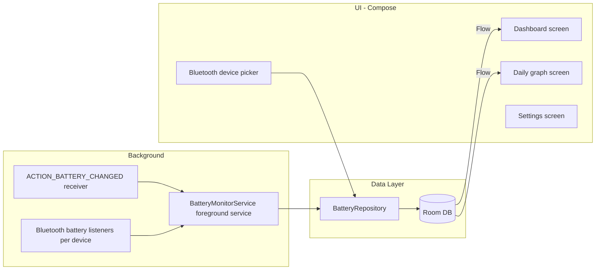

# BatteryMax App Plan

Build BatteryMax: a Compose app that monitors phone battery in the background via a foreground service, stores samples in Room, renders a daily battery graph, and tracks battery levels for **one or more** user-selected Bluetooth devices.

## Architecture

MVVM with a repository layer. Manual DI via the `Application` class (`BatteryMaxApp`).

## Data Layer (Room)

- `BatterySampleEntity`: id, timestamp, levelPercent, isCharging, temperature, voltage, `source` (PHONE or BT device MAC address). One table for phone and all Bluetooth samples.
- `TrackedDeviceEntity`: Bluetooth MAC address (primary key), display name, enabled flag. **Multiple rows** — one per tracked device.
- DAOs with `Flow` queries: all tracked devices, latest sample per source, samples for a day range.
- Sampling policy: insert on battery level change or every 5 minutes; prune data older than ~30 days.

## Background Monitoring

- `BatteryMonitorService`: foreground service (`connectedDevice` when Bluetooth is granted, otherwise `specialUse`) with a persistent notification listing phone and each tracked BT device.
- Registers `ACTION_BATTERY_CHANGED` for the phone battery.
- Watches **every** tracked Bluetooth address (merged flows); connection state is published per address.
- `BOOT_COMPLETED` receiver restarts the service after reboot; start/stop toggle on the Dashboard.
- Manifest: `FOREGROUND_SERVICE`, `FOREGROUND_SERVICE_CONNECTED_DEVICE`, `FOREGROUND_SERVICE_SPECIAL_USE`, `POST_NOTIFICATIONS`, `RECEIVE_BOOT_COMPLETED`, `REQUEST_IGNORE_BATTERY_OPTIMIZATIONS`, `BLUETOOTH_CONNECT`.

## Bluetooth Device Battery

Android has no public API for Classic Bluetooth battery, so use:

1. Primary: hidden system broadcast `android.bluetooth.device.action.BATTERY_LEVEL_CHANGED` plus `BluetoothDevice.getBatteryLevel()` via reflection.
2. Fallback: BLE GATT read of Battery Service (0x180F / 0x2A19), polled periodically while connected.

- Devices screen lists bonded devices; **Track** adds a device (does not remove others); **Stop** removes only that device.
- Permissions: `BLUETOOTH_CONNECT` (runtime, API 31+), legacy `BLUETOOTH` for API <= 30.
- Connect/disconnect via `ACTION_ACL_CONNECTED` / `DISCONNECTED`; Dashboard shows connected vs disconnected UI per device.

## UI (Compose, Material 3)

Four destinations with Navigation Compose:

- **Dashboard**: phone battery card; one Bluetooth card per tracked device (large % when connected, smaller % + Disconnected chip when not); monitoring toggle.
- **Graph**: device chips for Phone and all tracked devices; day navigation; zoom presets (1h, 3h, 100%, fit-to-data); Now button scrolls to current time.
- **Devices**: pull-to-refresh bonded list, connected devices first; track/stop multiple devices.
- **Settings**: version (`Version 1 (yyyy.MMddHH)`), permission status, battery-optimization opt-out.

## Versioning

- `versionName` = `"1"`
- `versionCode` = `yyyyMMddHH` at build time (local clock)
- Settings formats the code as `yyyy.MMddHH` for display

## Dependencies

- Room (runtime, ktx, compiler via KSP) + KSP plugin
- Navigation Compose, Lifecycle ViewModel Compose
- Vico (`compose-m3`) for charts

## Task Checklist

- [x] Add Room/KSP, Navigation Compose, ViewModel, and Vico dependencies
- [x] Create Room entities, DAOs, database, and BatteryRepository
- [x] Implement BatteryMonitorService and boot receiver
- [x] Implement Bluetooth battery reading and connection state tracking
- [x] Build Dashboard, Graph, Devices, and Settings screens
- [x] Wire navigation, manifest permissions, and verify build
- [x] Support multiple tracked Bluetooth devices (list in DB, service, Dashboard, Graph, Devices)
- [x] Date/hour-based versionCode with fixed versionName `1`

## Verification

Build with Gradle, then test on a device: enable monitoring, track two or more paired devices, confirm Dashboard cards and notification update per device, and Graph chips list each tracked device.
